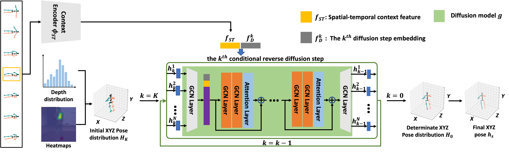
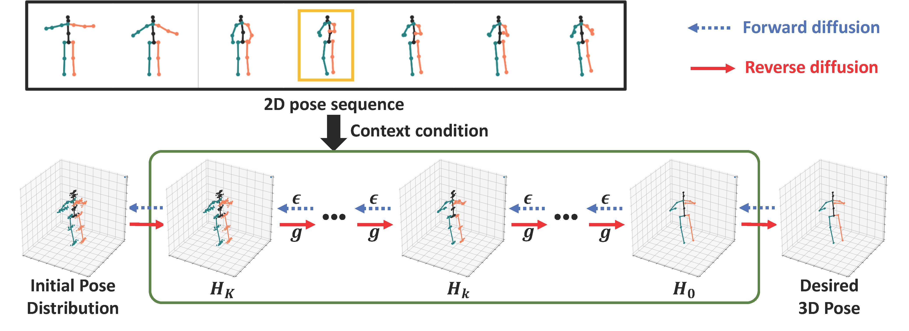

# [DiffPose: Toward More Reliable 3D Pose Estimation, CVPR2023](https://arxiv.org/abs/2211.16940)

[JIA GONG](https://scholar.google.com/citations?user=ZV-ThegAAAAJ&hl=zh-CN)<sup>+</sup><sup>1</sup>,
[Lin Geng Foo](https://scholar.google.com/citations?user=BDEOhasAAAAJ&hl=en&oi=ao)<sup>+</sup><sup>1</sup>,
[Zhipeng Fan](https://scholar.google.com/citations?user=5wftY7UAAAAJ&hl=en)<sup>2</sup>,
[Qiuhong Ke](https://scholar.google.com/citations?user=84qxdhsAAAAJ&hl=en&oi=ao)<sup>3</sup>,
[Hossein Rahmani](https://scholar.google.com/citations?user=zFyT_gwAAAAJ&hl=en&oi=ao)<sup>4</sup>,
[Jun Liu](https://people.sutd.edu.sg/~jun_liu/)<sup>1</sup>,

<sup>+</sup> equal contribution

<sup>1</sup>Singapore University of Technology and Design, <sup>2</sup>New York University, <sup>3</sup>Monash University, <sup>4</sup>Lancaster University


[|Paper|](https://arxiv.org/abs/2211.16940) [|Project Page|](https://gongjia0208.github.io/Diffpose/) [|SUTD-VLG-Lab|](https://github.com/sutdcv)

## DiffPose Model Architecture
<p align="center">  </p>


## DiffPose Diffusion Process
<p align="center">  </p> 

Our code is built on top of [DDIM](https://github.com/ermongroup/ddim).
### Environment

The code is developed and tested under the following environment:

* Python 3.8.2
* PyTorch 1.7.1
* CUDA 11.0

You can create the environment via:
```bash
conda env create -f environment.yml
```

### Dataset
Our datasets are based on [3d-pose-baseline](https://github.com/una-dinosauria/3d-pose-baseline) and [Video3D data](https://github.com/facebookresearch/VideoPose3D). We provide the GMM format data generated from the above datasets [here](https://www.dropbox.com/sh/54lwxf9zq4lfzss/AABmpOzg31PrhxzcxmFQt3cYa?dl=0). You should put the downloaded files into the `./data` directory.
Note that we only change the format of the Video3D data to make them compatible with our GMM-based DiffPose training strategy, and the value of the 2D pose in our dataset is the same as them.

### Evaluating pre-trained models for frame-based experiments

We provide the pre-trained diffusion model (with CPN-dected 2D Pose as input) [here](https://www.dropbox.com/sh/jhwz3ypyxtyrlzv/AABivC5oiiMdgPePxekzu6vga?dl=0). To evaluate it, put it into the `./checkpoint` directory and run:

```bash
CUDA_VISIBLE_DEVICES=0 python main_diffpose_frame.py \
--config human36m_diffpose_uvxyz_cpn.yml --batch_size 1024 \
--model_pose_path checkpoints/gcn_xyz_cpn.pth \
--model_diff_path checkpoints/diffpose_uvxyz_cpn.pth \
--doc t_human36m_diffpose_uvxyz_cpn --exp exp --ni \
>exp/t_human36m_diffpose_uvxyz_cpn.out 2>&1 &
```

We also provide the pre-trained diffusion model (with Ground truth 2D pose as input) [here](https://www.dropbox.com/sh/jhwz3ypyxtyrlzv/AABivC5oiiMdgPePxekzu6vga?dl=0). To evaluate it, put it into the `./checkpoint` directory and run:

```bash
CUDA_VISIBLE_DEVICES=0 python main_diffpose_frame.py \
--config human36m_diffpose_uvxyz_gt.yml --batch_size 1024 \
--model_pose_path checkpoints/gcn_xyz_gt.pth \
--model_diff_path checkpoints/diffpose_uvxyz_gt.pth \
--doc t_human36m_diffpose_uvxyz_gt --exp exp --ni \
>exp/t_human36m_diffpose_uvxyz_gt.out 2>&1 &
```


### Training new models

* To train a model from scratch (CPN 2D pose as input), run:

```bash
CUDA_VISIBLE_DEVICES=0 python main_diffpose_frame.py --train \
--config human36m_diffpose_uvxyz_cpn.yml --batch_size 1024 \
--model_pose_path checkpoints/gcn_xyz_cpn.pth \
--doc human36m_diffpose_uvxyz_cpn --exp exp --ni \
>exp/human36m_diffpose_uvxyz_cpn.out 2>&1 &
```

* To train a model from scratch (Ground truth 2D pose as input), run:

```bash
CUDA_VISIBLE_DEVICES=0 python main_diffpose_frame.py --train \
--config human36m_diffpose_uvxyz_gt.yml --batch_size 1024 \
--model_pose_path checkpoints/gcn_xyz_gt.pth \
--doc human36m_diffpose_uvxyz_gt --exp exp --ni \
>exp/human36m_diffpose_uvxyz_gt.out 2>&1 &
```

### Bibtex
If you find our work useful in your research, please consider citing:

    @article{gong2022diffpose,
    title={DiffPose: Toward More Reliable 3D Pose Estimation},
    author={Gong, Jia and Foo, Lin Geng and Fan, Zhipeng and Ke, Qiuhong and Rahmani, Hossein and Liu, Jun},
    journal={arXiv preprint arXiv:2211.16940},
    year={2022}
    }

## Acknowledgement

Part of our code is borrowed from [DDIM](https://github.com/ermongroup/ddim), [VideoPose3D](https://github.com/facebookresearch/VideoPose3D), [Graformer](https://github.com/Graformer/GraFormer), [MixSTE](https://github.com/JinluZhang1126/MixSTE) and [PoseFormer](https://github.com/zczcwh/PoseFormer). We thank the authors for releasing the codes.
